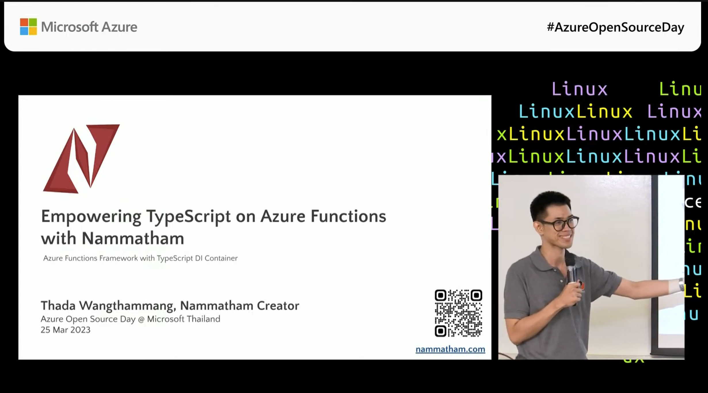

# Introduction
<p align="center">
  <a href="http://thadaw.com/" target="blank"></a>
Type-safe Serverless Library for Azure Functions and friends
</p>

[](https://www.npmjs.com/package/nammatham) [](https://www.npmjs.com/package/nammatham)


> 🚧 Alpha Stage Internal Use Only 🚧
> 
> Please note that Nammatham v2 is currently in its Alpha stage and is intended for internal use only. As we actively develop and refine the platform, be aware that the API may undergo frequent changes. [Tracking v2 Roadmap](https://github.com/thaitype/nammatham/issues?q=is%3Aissue+is%3Aopen+label%3Av2-blocker)


Nammatham (นามธรรม in Thai, pronounced `/naam ma tham/`, means **abstract** in Thai) is Azure Function Nodejs.


## Getting Started for Azure Functions

### Install

```bash
# Including all packages
npm install nammatham@alpha
```

### Example

You can see [examples](https://github.com/thaitype/nammatham/tree/main/examples) or follow the minimal app getting started below:

> `initNammatham.create()` is a factory function for creating Nammatham App, it's a wrapper for Azure Functions App.

```typescript
import { initNammatham, expressPlugin } from 'nammatham';

const n = initNammatham.create();
const func = n.func;
const app = n.app;

const helloFunction = func
  .httpGet('hello', {
    route: 'hello-world',
  })
  .handler(async c => {
    c.context.log('HTTP trigger function processed a request.');
    c.context.debug(`Http function processed request for url "${c.trigger.url}"`);
    const name = c.trigger.query.get('name') || (await c.trigger.text()) || 'world';
    return c.text(`Hello, ${name}!`);
  });

app.addFunctions(helloFunction);

const dev = process.env.NODE_ENV === 'development';
app.register(expressPlugin({ dev }));
app.start();
```

Then edit `package.json` like this;

```json
{
  "main": "dist/src/main.js",
  "scripts": {
    "dev": "cross-env NODE_ENV=development tsx watch src/main.ts",
    "start": "tsc && func start"
  }
}
```

Run Dev Server on locally, (For dev server use `tsx watch` for reloading run dev server using `express` )

```
npm run dev
```

Run Azure Functions on locally (Using Official Azure Functions Node.js)

```
npm start
```


## Talks 
Empowering TypeScript on Azure Functions with Nammatham, Azure Open Source Day @ Microsoft Thailand, 25 Mar 2023
[](https://www.youtube.com/watch?v=n6B4-5Lt2h0) (Thai speech, subtitle will added later)
- Slides: https://docs.google.com/presentation/d/1WUIXaUxXaiixZ2bgGCfx-f4Gdrmjl4RfbwKaEfAC6t4/edit?usp=sharing

